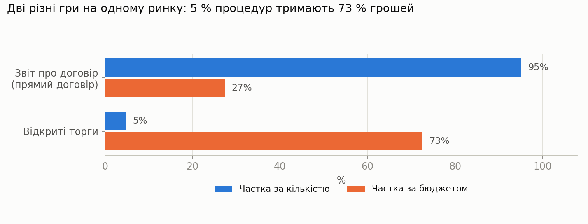
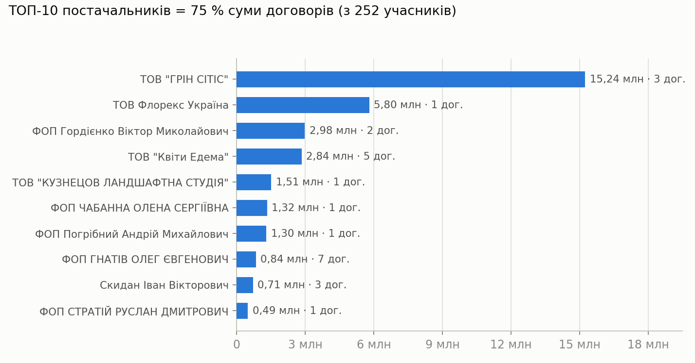
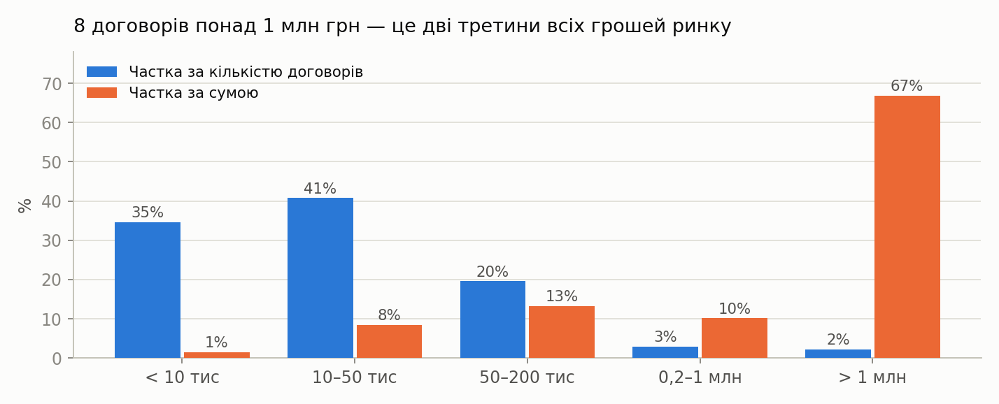
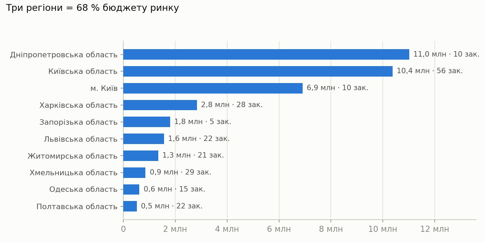
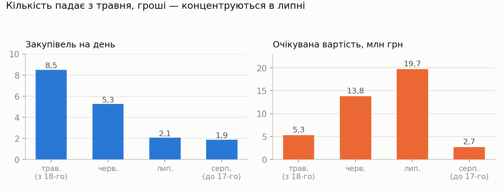
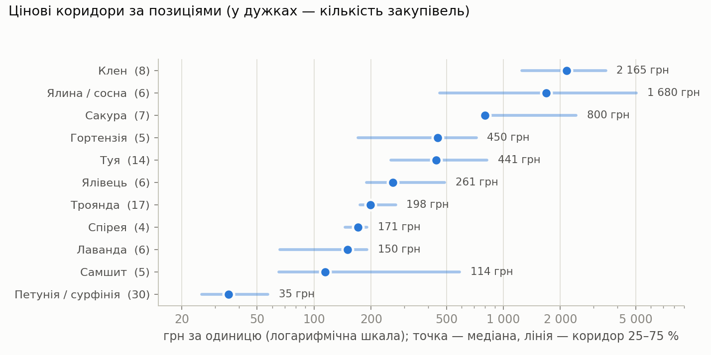

# Аналіз ринку публічних закупівель: розсадницька продукція та посадковий матеріал

| | |
|---|---|
| **Замовник аналізу** | DC Link |
| **Джерело даних** | `prozorro-дані-2026-08-17-2002.xlsx` — вивантаження Prozorro від 17.08.2026, 20:02 |
| **Період вибірки** | 18.05.2026 – 17.08.2026 (92 дні) |
| **Дата звіту** | 17.08.2026 |

---

## ⚠️ Важливе застереження щодо предмета вибірки

Файл містить **не ІТ-техніку**, а **розсадницьку продукцію та посадковий матеріал** —
коди ДК 021:2015 класу 03 (`03450000-9`, `03440000-6`, `03451000-6`, `03451100-7`,
`03451300-9`, `03452000-3`, `03441000-3`). У раніше зафіксованому профілі DC Link
основним ринком був клас 30 (комп'ютери, ноутбуки, моноблоки).

Тобто це **вивантаження іншого товарного сегмента**. Аналіз нижче виконано за фактичним
змістом файлу. Якщо це розвідка нового напряму — звіт відповідає задачі. Якщо фільтр у
застосунку було виставлено помилково — потрібне повторне вивантаження за класом 30, і
жоден висновок нижче до ІТ-ринку не застосовний.

---

## 1. Головне у семи цифрах

| Показник | Значення |
|---|---|
| Закупівель у вибірці | **373** |
| Сумарна очікувана вартість | **41,49 млн грн** |
| Сума укладених договорів (без скасованих) | **43,83 млн грн** |
| Унікальних замовників | **266** |
| Унікальних постачальників (за ЄДРПОУ) | **252** |
| Медіанний чек закупівлі | **18 540 грн** |
| Частка бюджету, що припадає на 18 відкритих торгів | **72,5 %** |

**Одне речення:** ринок складається з двох майже не пов'язаних сегментів — сотень
дрібних прямих договорів по 10–50 тис. грн і вісімнадцяти відкритих торгів, у яких
лежить майже три чверті всіх грошей і де реальної конкуренції практично немає.

---

## 2. Структура ринку: дві різні гри

| Процедура | Закупівель | Частка шт. | Бюджет, грн | Частка грошей | Медіанний чек |
|---|---:|---:|---:|---:|---:|
| Звіт про договір (прямий) | 355 | 95,2 % | 11 392 459 | 27,5 % | 17 000 |
| Відкриті торги (нові) | 18 | 4,8 % | 30 102 194 | 72,5 % | 553 286 |

Це два різні бізнеси з різними правилами входу:

**Сегмент А — прямі договори (355 закупівель, 11,4 млн грн).**
Замовник обирає постачальника без конкурсу і публікує звіт постфактум. Виграє не ціна,
а те, чи є ви в полі зору замовника в момент рішення. 129 договорів — до 10 тис. грн,
ще 152 — від 10 до 50 тис. Це «дрібнороздрібний» потік з довгим хвостом ЄДРПОУ.

**Сегмент Б — відкриті торги (18 закупівель, 30,1 млн грн).**
Середній лот — понад 1,6 млн грн. Тут концентрується весь великий грошовий потік, і саме
сюди має бути спрямований основний ресурс, якщо мета — обсяг, а не кількість угод.

> **Показова деталь.** 74 закупівлі процедурою «Звіт про договір» мають вартість понад
> 50 тис. грн — разом 7,09 млн грн. Це закупівлі, які за розміром вже помітні, але все
> одно проходять без конкурсу. Найбільша з них — 700 тис. грн («Олевський лісгосп АПК»,
> Житомирська область). Це найдоступніший для входу сегмент з відчутними чеками.

---

## 3. Конкуренція: її майже немає

З 18 відкритих торгів:

| Кількість пропозицій | Торгів | Медіанна економія |
|---|---:|---:|
| 1 (безальтернативний) | 13 | 1,2 % |
| 2 | 3 | 2,6 % |
| 3 | 2 | 7,9 % |

**72 % відкритих торгів мали лише одну пропозицію.** Середня економія по всій вибірці
відкритих торгів — **0,77 %**, медіанна — **2,15 %**. Для порівняння: на конкурентних
сегментах Prozorro нормою є 8–15 %.

Що це означає практично:

- **Бар'єр входу — не ціна, а відповідність технічним вимогам.** Якщо у торгах з чеком
  1–10 млн грн систематично подається один учасник, то або специфікацію написано «під
  постачальника», або решта ринку фізично не має потрібного асортименту/розміру партії.
- **Кожна друга пропозиція виграє.** З 25 поданих пропозицій 15 унікальних учасників —
  тобто вхід у торги майже гарантує результат для того, хто взагалі дійшов до подання.
- **Строк на підготовку — 8 днів** (медіана і мода одночасно; максимум 10). Це жорстко:
  без заздалегідь підготовленого пакета документів і зафіксованих цін від розсадника
  встигнути неможливо.

### Хто подається і хто програє

| Учасник | Пропозицій | Сума пропозицій, грн | Виграно, грн |
|---|---:|---:|---:|
| ТОВ «ГРІН СІТІС» (42543187) | 4 | 14 060 819 | 15 242 421 |
| ТОВ «Флорекс Україна» (33781534) | 1 | 4 834 950 | 5 801 940 |
| **ТОВ «ГОЛЛАНДСЬКІ ТРОЯНДИ» (30941257)** | **2** | **3 597 850** | **0** |
| ТОВ «Квіти Едема» (41016860) | 6 | 3 525 263 | 2 838 315 |
| ФОП Гордієнко В. М. (2831604438) | 2 | 2 982 600 | 2 982 600 |

**ТОВ «ГОЛЛАНДСЬКІ ТРОЯНДИ» — єдиний системний програвач вибірки:** дві пропозиції на
3,6 млн грн, жодної перемоги. Найактивніший подавач — «Квіти Едема» (6 пропозицій).

---

## 4. Концентрація постачальників

| Метрика | Значення | Інтерпретація |
|---|---:|---|
| CR4 (частка 4 найбільших) | **61,3 %** | Висока концентрація |
| ТОП-10 | **75,4 %** | Ринок «голови» |
| ТОП-20 | **80,7 %** | Хвіст майже нічого не важить у грошах |
| HHI | **1517** | Помірна концентрація за класифікацією антимонопольних органів (1500–2500) |

Але ці ж дані з іншого боку:

- **182 з 252 постачальників мають лише один договір.** Разом вони тримають 37,5 % суми.
- Лише **5 постачальників** мають 5 і більше договорів.
- Лише **7 постачальників** працюють більш ніж в одному регіоні; максимум — 4 регіони
  (ТОВ «ГРІН СІТІС» і ТОВ «Квіти Едема»).

**Висновок: ринок не захоплений — він фрагментований.** «ГРІН СІТІС» домінує в грошах
(15,24 млн грн, 34,8 % ринку), але робить це трьома договорами. Це не мережа й не
монополія — це один гравець, який виграв кілька дуже великих торгів.

### Розподіл за типом постачальника

| Тип | Договорів | Сума, грн | Частка | Медіанний чек |
|---|---:|---:|---:|---:|
| Юрособа (ТОВ / ПП) | 43 | 26 672 138 | 60,9 % | 42 240 |
| ФОП | 169 | 11 865 317 | 27,1 % | 17 400 |
| Фізособа / інше | 137 | 4 591 202 | 10,5 % | 14 490 |
| Держ./комунальні підпр. | 20 | 446 120 | 1,0 % | 17 725 |
| Фермерське господарство | 4 | 253 608 | 0,6 % | 61 200 |

**Юрособи — 11 % договорів, але 61 % грошей.** Великі лоти системно йдуть до ТОВ, дрібні —
до ФОП і фізосіб. Для компанії у формі ТОВ це структурна перевага у сегменті Б.

---

## 5. Розмір угоди: де насправді гроші

| Діапазон | Договорів | Частка шт. | Сума, грн | Частка грошей |
|---|---:|---:|---:|---:|
| < 10 тис | 129 | 34,6 % | 628 099 | 1,4 % |
| 10–50 тис | 152 | 40,8 % | 3 678 060 | 8,4 % |
| 50–200 тис | 73 | 19,6 % | 5 780 597 | 13,2 % |
| 0,2–1 млн | 11 | 2,9 % | 4 442 875 | 10,1 % |
| **> 1 млн** | **8** | **2,1 %** | **29 298 754** | **66,8 %** |

Вісім договорів — дві третини ринку. 281 договір (75 % за кількістю) — менше 10 % грошей.

**Це визначає стратегію напряму:** обробка дрібного потоку в цьому сегменті економічно
не окупається, якщо тільки вона не автоматизована повністю. Один виграний торг на 2 млн
грн дорівнює приблизно ста угодам «Звіт про договір» медіанного розміру.

---

## 6. Географія

| Регіон | Закупівель | Бюджет, грн | Частка | Медіанний чек |
|---|---:|---:|---:|---:|
| Дніпропетровська обл. | 10 | 11 017 195 | 26,6 % | 21 260 |
| Київська обл. | 56 | 10 375 530 | 25,0 % | 30 090 |
| м. Київ | 10 | 6 902 487 | 16,6 % | 60 738 |
| Харківська обл. | 28 | 2 842 140 | 6,9 % | 46 264 |
| Запорізька обл. | 5 | 1 806 202 | 4,4 % | 22 005 |
| Львівська обл. | 22 | 1 570 144 | 3,8 % | 19 910 |
| Житомирська обл. | 21 | 1 345 639 | 3,2 % | 23 800 |
| Решта 16 регіонів | 221 | 5 635 316 | 13,6 % | — |

**Три регіони = 68,2 % бюджету.** Причому вони працюють по-різному:

- **Дніпропетровська обл.** — 27 % грошей на 10 закупівлях, з них 10,78 млн — один торг
  КП «Міськзеленбуд». Прибрати цей торг — і регіон падає на рівень Львівщини. Це не ринок,
  це один замовник.
- **Київська обл. + м. Київ** — 66 закупівель на 17,3 млн грн, глибокий і регулярний попит.
  Це єдина територія з реальною повторюваністю.
- **Харківська обл.** — 28 закупівель, високий медіанний чек (46 тис.), але скромний
  сумарний бюджет: багато середніх угод.

Регіони з великою кількістю закупівель і мізерним бюджетом (Хмельницька — 29 закупівель
на 0,86 млн; Вінницька — 26 на 0,48 млн; Чернігівська — 21 на 0,19 млн) — це чистий
дрібнороздрібний потік.

---

## 7. Сезонність

| Місяць | Закупівель | На день | Бюджет, грн | Медіанний чек |
|---|---:|---:|---:|---:|
| Травень (з 18-го) | 119 | 8,5 | 5 289 056 | 19 940 |
| Червень | 158 | 5,3 | 13 827 213 | 17 000 |
| Липень | 64 | 2,1 | 19 683 821 | 21 780 |
| Серпень (до 17-го) | 32 | 1,9 | 2 694 565 | 17 750 |

Два різні цикли розходяться в часі:

- **Кількість** падає в 4,5 раза від травня до серпня — весняна хвиля дрібного озеленення
  закінчується в червні.
- **Гроші** пікують у липні (19,7 млн грн на 64 закупівлях) — великі торги оголошуються
  влітку, під осінню посадку.

**Практичний висновок:** підготовка до великих торгів має завершуватися до кінця червня.
Календар роботи з дрібним потоком — березень–червень; календар великих торгів — липень.
Вибірка не покриває осінній пік (вересень–листопад), який у цій галузі традиційно другий
за обсягом — для повної картини потрібне вивантаження за 12 місяців.

---

## 8. Цінові орієнтири

Розраховано **лише за 218 закупівлями з однією позицією**, де ціна за одиницю є
достовірною (див. §10 щодо обмеження).

| Позиція | Закупівель | min | 25 % | **Медіана** | 75 % | max |
|---|---:|---:|---:|---:|---:|---:|
| Петунія / сурфінія | 30 | 15 | 26 | **35** | 57 | 350 |
| Самшит | 5 | 24 | 65 | **114** | 586 | 2 790 |
| Лаванда | 6 | 30 | 66 | **150** | 190 | 303 |
| Спірея | 4 | 70 | 146 | **171** | 191 | 250 |
| Троянда | 17 | 78 | 175 | **198** | 270 | 500 |
| Ялівець | 6 | 171 | 189 | **261** | 490 | 1 450 |
| Туя | 14 | 140 | 255 | **441** | 820 | 2 180 |
| Гортензія | 5 | 171 | 171 | **450** | 720 | 930 |
| Сакура | 7 | 750 | 772 | **800** | 2 421 | 8 188 |
| Ялина / сосна | 6 | 150 | 460 | **1 680** | 5 045 | 8 250 |
| Клен | 8 | 63 | 1 253 | **2 165** | 3 475 | 16 000 |

*Усі значення — грн за одиницю, очікувана вартість замовника (не остаточна ціна договору).*

Розкид у 20–100 разів у межах однієї назви — не помилка даних, а відображення розміру
саджанця: «клен» за 63 грн і «клен» за 16 000 грн — це різні товари (сіянець проти
крупноміра з комом). **Тому в тендерній заявці критичною є не назва, а параметри:
висота, обхват стовбура, тип кореневої системи, об'єм контейнера.** Замовники, які їх
не вказують, отримують непорівнянні пропозиції — це вікно для гри на якості.

### Структура бюджету за категоріями (однопозиційні закупівлі)

| Категорія | Закупівель | Штук | Бюджет, грн | Частка | Медіанна ціна |
|---|---:|---:|---:|---:|---:|
| Квіти та розсада однорічних | 63 | 30 630 | 1 429 599 | 22,7 % | 54 |
| Хвойні (туя, ялівець, ялина) | 31 | 2 836 | 1 291 278 | 20,5 % | 433 |
| Дерева (саджанці) | 48 | 8 074 | 1 288 910 | 20,5 % | 786 |
| Багаторічники, злаки, газон | 18 | 5 533 | 986 318 | 15,7 % | 202 |
| Троянди | 19 | 2 052 | 356 595 | 5,7 % | 198 |
| Кущі декоративні | 16 | 1 883 | 341 779 | 5,4 % | 317 |
| Ґрунт, кора, добрива, супутнє | 6 | 340 | 94 319 | 1,5 % | 284 |
| Не класифіковано | 17 | 5 164 | 508 222 | 8,1 % | 195 |

---

## 9. Замовники: до кого йти

Попит майже повністю сконцентрований у комунальних підприємствах озеленення.

| Замовник | ЄДРПОУ | Закупівель | Бюджет, грн |
|---|---:|---:|---:|
| КП «Міськзеленбуд» Дніпровської міськради | 33338361 | 1 | 10 779 489 |
| КП зелених насаджень Печерського р-ну м. Києва | 3359760 | 2 | 5 099 990 |
| КП зелених насаджень Дарницького р-ну м. Києва | 31722949 | 2 | 4 046 200 |
| КП зелених насаджень Солом'янського р-ну м. Києва | 31806913 | 2 | 3 165 883 |
| КП «Титан» | 19268685 | 1 | 1 418 042 |
| СКП «Харківзеленбуд» | 3362152 | 1 | 1 359 748 |
| КП зелених насаджень Оболонського р-ну м. Києва | 5416745 | 1 | 1 334 302 |
| КП зелених насаджень Голосіївського р-ну м. Києва | 3359799 | 2 | 1 003 010 |
| ДП «Олевський лісгосп АПК» | 5418483 | 1 | 700 000 |
| Гатненська сільська рада | 4358508 | 1 | 496 000 |

**ТОП-10 замовників = 70,9 % бюджету ринку.** З них шість — київські районні КП
зелених насаджень. Це фактично одна цільова група з передбачуваним циклом закупівель.

Водночас **197 з 266 замовників зробили лише одну закупівлю** за квартал — це разові
шкільні, медичні та сільрадівські замовлення, які не формують повторюваного попиту.

---

## 10. Якість даних і застереження

Ці обмеження треба враховувати при використанні звіту; всі розрахунки вище вже їх
враховують.

1. **«Ціна за одиницю» коректна лише для однопозиційних закупівель.** У багатопозиційних
   лотах вона рахується як «вартість усього лоту ÷ кількість цієї позиції» — тобто для
   кожної позиції повторює всю суму лоту. Приклад: лот на 400 000 грн з 29 позиціями дає
   суму «ціна × кількість» у 11,6 млн грн. **155 із 373 закупівель** мають більше однієї
   позиції — усі цінові розрахунки в §8 виконано на решті 218.

2. **Скасовані договори треба виключати.** У вибірці 2 скасовані договори. Найбільший
   випадок: закупівля `UA-2026-07-02-006945-a` (КП «Міськзеленбуд», Дніпро) має договір
   `-a1` на 10,74 млн грн зі статусом *cancelled* і договір `-a2` на 12,89 млн грн зі
   статусом *active*. Без фільтрації сума договорів по ринку завищується на 12,85 млн грн
   (54,86 млн замість 43,83 млн).

3. **Сума договору може перевищувати очікувану вартість.** У 3 з 18 відкритих торгів
   договір дорожчий за очікувану вартість: Дніпро («Міськзеленбуд») +19,6 %, Київ
   (Печерський р-н) +16,0 %, Харків («Харківзеленбуд») +11,2 %. Ймовірне пояснення — додаткові угоди,
   врахована в договорі сума яких потрапляє у вивантаження. Через це «економія» по
   відкритих торгах у §3 занижена; це не показник переплати сам по собі.

4. **26 ЄДРПОУ мають кілька варіантів написання назви.** Найяскравіший приклад —
   ТОВ «Епіцентр К» (32490244) фігурує як «ТОВАРИСТВО З ОБМЕЖЕНОЮ ВІДПОВІДАЛЬНІСТЮ
   "ЕПІЦЕНТР К"», «ТзОВ "Епіцентр К"» і «ТОВ Епіцентр К». **Будь-яка агрегація по назві
   постачальника дає хибний результат — групувати треба лише за ЄДРПОУ.** У цьому звіті
   так і зроблено.

5. **5 записів мають розбіжність між переможцем і стороною договору** (з 383 пар).
   Наприклад, у `UA-2026-06-04-007421-a` переможець — ТОВ «ГРІН СІТІС», а договір
   укладено з ФОП Погрібним А. М. Це, найімовірніше, артефакт вивантаження при кількох
   рішеннях про намір, а не порушення. Для юридичних висновків ці випадки треба
   перевіряти на сайті Prozorro поштучно.

6. **Вибірка — квартал, а не рік.** Період 18.05–17.08.2026 не покриває осінній пік
   посадкового сезону. Усі висновки про сезонність — попередні.

7. **Документи.** 2 012 записів, з них 1 183 завантажено (2,07 ГБ), 765 відсіяно
   фільтром, 64 залишились у черзі. Незавершена черга означає, що частину додатків до
   тендерів (у т. ч. технічні специфікації) ще не отримано.

---

## 11. Висновки і рекомендації для DC Link

### Що показують дані

1. **Ринок малий і концентрований.** 41,5 млн грн очікуваної вартості за квартал, з яких
   30,1 млн — у 18 торгах. У річному вимірі це орієнтовно 150–200 млн грн (з поправкою на
   осінній пік — імовірно більше).
2. **Конкуренція формальна.** 72 % відкритих торгів — одна пропозиція, медіанна економія
   2,15 %. Це або ознака недоступності специфікацій для сторонніх гравців, або
   незаповнена ніша.
3. **Вхід не заблокований капіталом.** 182 постачальники з одним договором показують, що
   бар'єр на дрібному сегменті практично відсутній. Заблокований саме великий сегмент —
   асортиментом і логістикою крупноміра.
4. **Домінант один — «ГРІН СІТІС» (34,8 % ринку) — і він вразливий:** його позиція
   тримається на трьох договорах з двома замовниками.

### Рекомендації

**Якщо мета — обсяг:**

- Сфокусуватися на **6 київських районних КП зелених насаджень + «Харківзеленбуд» +
  дніпровський «Міськзеленбуд»**. Це 8 ЄДРПОУ, які контролюють ~70 % грошей ринку.
- **Точка входу — липень.** Готовність (сертифікати, зразки, підтверджені ціни від
  розсадників, банківська гарантія) має бути на 100 % до 30 червня — 8 днів на подання
  не дають часу нічого добирати.
- **Цільовий лот — 1–3 млн грн.** У цій зоні є торги, куди подається лише один учасник, і
  де ще немає ефекту масштабу «ГРІН СІТІС».

**Якщо мета — швидкий вхід і напрацювання історії:**

- **74 закупівлі «Звіт про договір» понад 50 тис. грн (7,09 млн грн)** — це прямі
  договори без конкурсу з відчутним чеком. Робота тут — це продажі та присутність у
  замовника, а не тендерна робота. Регіони з найбільшою щільністю таких закупівель:
  Київська, Хмельницька, Харківська, Вінницька.
- Дрібніший потік (< 10 тис. грн, 129 договорів на 0,63 млн грн) економічного сенсу не
  має — 1,4 % грошей ринку.

**Що моніторити далі:**

- ЄДРПОУ **42543187** («ГРІН СІТІС»), **33781534** («Флорекс Україна»), **41016860**
  («Квіти Едема») — три гравці, які реально борються за великі лоти.
- ЄДРПОУ **30941257** («ГОЛЛАНДСЬКІ ТРОЯНДИ») — подається, але не виграє. Варто
  розібратися, з якої причини: це підкаже, які саме вимоги відсіюють нових учасників.
- **Три торги ще не завершені** (статус «Визначено переможця») — можливі оскарження:
  `UA-2026-08-09-000178-a` (0,36 млн, Запоріжжя), `UA-2026-08-04-000256-a` (1,42 млн,
  Запоріжжя), `UA-2026-06-23-013066-a` (2,92 млн, Київська обл.).

### Наступний крок з даними

Вивантажити **12 місяців** по тих самих кодах ДК021 і **дочекатися завершення черги
завантаження документів** (64 файли). Технічні специфікації великих торгів — це єдине
джерело, яке відповість на головне питання цього звіту: чому в лоти на 5–10 млн грн
подається один учасник.

---

*Звіт побудовано на 8 аркушах вивантаження: Закупівлі (373), Лоти (18), Номенклатура
(1 152), Пропозиції (25), Переможці (378), Договори (375), Документи (2 012).*
